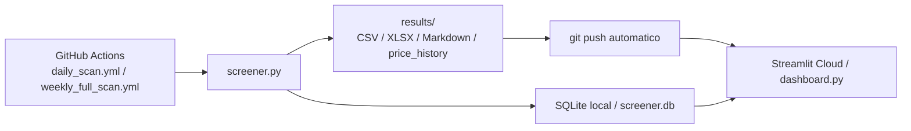

# Stock Opportunity Screener — Documento de Handoff

## 1. Visión general

`Stock Opportunity Screener` es una herramienta de screening y análisis para detectar empresas temporalmente deprimidas con potencial de recuperación a medio plazo. El objetivo operativo no es hacer trading intradía ni buy&hold puro, sino identificar compañías de calidad razonable que hayan sufrido una caída relevante y que empiecen a mostrar condiciones cuantitativas, de recuperación y técnicas compatibles con una entrada escalonada o directa.

La metodología declarada en el código y en la documentación del proyecto está inspirada en la estrategia de Gregorio Hernández: priorizar calidad histórica, aceptar que el problema actual pueda ser temporal, y exigir confirmación técnica antes de convertir una caída en oportunidad operable.

Estado actual del proyecto:
- Motor batch implementado en `screener.py`
- Configuración centralizada en `config.py`
- Persistencia SQLite en `database.py`
- Dashboard Streamlit en `dashboard.py`
- Automatización diaria y semanal con GitHub Actions
- Clasificación operativa categórica + hard rules
- Capa causal todavía en modo stub

## 2. Arquitectura del sistema

Flujo principal:



Relación entre componentes:
- `config.py`: define universo de mercados, umbrales, pesos, overrides sectoriales, flags de salida y parámetros de ejecución.
- `screener.py`: descarga datos, ejecuta las 5 capas, aplica hard rules, genera clasificación final, exporta resultados y persiste historial/alertas/watchlist.
- `database.py`: encapsula SQLite, el historial de evaluaciones, watchlist, transiciones y alertas.
- `dashboard.py`: consume `results/` y, en local, también `screener.db`; protege el acceso con password y presenta tabla, detalle, gráfico y fichas Markdown.

## 3. Pipeline de análisis — Las 5 capas

### 3.1 Capa 1 — Análisis cuantitativo

Qué hace:
- Agrupa fundamental + valoración en `analyze_quantitative()`.
- Devuelve `passed`, `status`, `score`, subresultado `fundamental`, subresultado `valuation`, `metrics` y `flags`.
- Marca `status = "pass"` si el score cuantitativo es `>= 25`; si no, `fail`.

Subcapa fundamental (`analyze_fundamental()`):
- Historial de dividendos:
  - años con dividendo en últimos 10
  - recorte reciente
  - pico de dividendo estimado
  - años consecutivos antes del corte
- Dividendo actual:
  - `dividend_yield_pct`
  - `payout_ratio_pct`
- Solvencia y tamaño:
  - `debt_to_equity`
  - `net_debt_ebitda`
  - `market_cap_millions`
  - `avg_daily_volume`
  - `avg_daily_volume_20d`
- Rentabilidad:
  - `roe_pct`
- Deterioro/mejora recientes:
  - `quarterly_debt_change_pct`
  - `margin_type`
  - `current_margin_pct`
  - `avg_last_4q_margin_pct`
  - `margin_delta_pp`

Umbrales usados desde `config.py`:
- `min_historical_div_years = 5`
- `min_peak_dividend_yield = 2.0`
- `current_div_bonus_threshold = 1.0`
- `max_payout_ratio = 90.0`
- `max_debt_to_equity = 2.0`
- `max_net_debt_ebitda = 4.0`
- `min_roe = 8.0`
- `roe_soft_floor = 3.0`
- `min_positive_earnings_years = 3`
- `min_market_cap_millions = 500`
- `min_avg_daily_volume = 100000`

Comportamiento relevante:
- El dividendo actual puede dar bonus, pero no penaliza por sí mismo si es bajo o cero.
- Si `market_cap` está por debajo del mínimo o la liquidez media diaria está por debajo del mínimo, la capa devuelve `score = 0` y descarta la compañía en esta capa.

Subcapa valoración (`analyze_valuation()`):
- Métricas:
  - `per`
  - `historical_avg_pe`
  - `per_discount_pct`
  - `dividend_yield_pct`
  - `historical_avg_div_yield_pct`
  - `div_yield_premium_pct`
  - `drop_from_52w_high_pct`
  - `drop_from_multiyear_high_pct`
  - `price_to_book`
  - `ev_ebitda`
  - `dist_sma200_pct`

Umbrales usados desde `config.py`:
- `max_per = 18.0`
- `per_discount_vs_historical = 25.0`
- `div_yield_premium_vs_historical = 20.0`
- `min_drop_from_52w_high = 15.0`
- `max_drop_from_52w_high = 60.0`
- `max_price_to_book = 3.0`
- `max_ev_ebitda = 12.0`

Ponderación actual:
- `weight_fundamental = 0.35`
- `weight_valuation = 0.40`

Output:
- Score cuantitativo agregado
- Flags de fundamental + valoración
- Subscores separados

### 3.2 Capa 2 — Heurística causal

Implementación actual:
- `analyze_causal()` es un stub.

Output actual:
- `causal_classification = "pendiente"`
- `causal_confidence = 0`
- `problem_type = "desconocido"`
- `justification = "Pendiente de implementar"`

Peso numérico:
- No participa en el cálculo directo del score total.
- Sí participa en hard rules y clasificación operativa cuando la implementación se complete.

### 3.3 Capa 3 — Señales de recuperación

Implementación actual: `analyze_recovery()`.

Señales implementadas:
- `margin_stabilization`
- `eps_stabilization`
- `debt_reduction`
- `dividend_maintained`
- `insider_buying`
- `analyst_upgrade`

Puntuación por fuerza:
- `alta = 5`
- `media = 3`
- `baja = 1`

Estados:
- `confirmada` si `recovery_score >= 12`
- `parcial` si `recovery_score >= 6`
- `ausente` si `recovery_score < 6`

Output:
- `recovery_status`
- `recovery_score`
- `signals` con `type`, `strength`, `evidence`, `points`
- `metrics` auxiliares

Peso numérico:
- No participa en el score total ponderado.
- Sí participa en clasificación operativa y hard rules.

### 3.4 Capa 4 — Análisis técnico

Implementación actual: `analyze_technical()`.

Indicadores y señales:
- RSI 14
- divergencia alcista RSI
- MACD diario
- histograma MACD convergente
- estocástico 14/3/3
- MACD semanal
- MA40 semanal
- doble suelo (`base_pattern_detected`)
- proxy de ruptura de directriz (`trendline_break`)
- SMA50 / SMA200
- volumen relativo vs media
- soporte y cercanía a soporte

Umbrales usados desde `config.py`:
- `rsi_period = 14`
- `rsi_oversold = 35`
- `rsi_recovery_zone = 45`
- `rsi_divergence_min_window = 20`
- `rsi_divergence_max_window = 60`
- `rsi_divergence_bonus_points = 10`
- `macd_fast = 12`
- `macd_slow = 26`
- `macd_signal = 9`
- `sma_short = 50`
- `sma_long = 200`
- `volume_increase_threshold = 1.3`
- `support_proximity_pct = 5.0`
- `support_lookback_days = 120`
- `history_period = "2y"`

Estados técnicos:
- `fuerte` si `score >= 70`
- `razonable` si `score >= 45`
- `incompleto` si `score >= 25`
- `sin_suelo` si `score < 25`

Peso numérico:
- `weight_technical = 0.25`

Output:
- `score`
- `status`
- `signals`
- `metrics`
- `flags`

### 3.5 Capa 5 — Plan operativo

Implementación actual: `generate_operational_plan()`.

Qué hace:
- Convierte las capas previas en una propuesta operativa legible.
- Genera clasificación categórica, zonas de entrada/salida, invalidaciones, horizonte y explicación.

Clasificación base generada por esta capa:
- `descarte`
- `seguimiento`
- `pendiente_confirmacion`
- `entrada_escalada`
- `entrada_directa`

Criterios de asignación en código:
- `descarte` si la Capa 1 no pasa (`quantitative_score < 40`)
- `entrada_directa` si:
  - Capa 1 fuerte (`> 60`)
  - causal fuerte o pendiente
  - recuperación fuerte (`confirmada` o `pendiente`)
  - técnica fuerte
- `entrada_escalada` si:
  - Capa 1 fuerte
  - causal fuerte o pendiente
  - recuperación fuerte
  - técnica razonable
- `pendiente_confirmacion` si:
  - Capa 1 pasa
  - causal pasa
  - recuperación pasa
  - técnica incompleta
- `seguimiento` si solo destaca claramente la Capa 1

Salida:
- `final_classification`
- `entry_zone_min`, `entry_zone_max`, `entry_zone`
- `exit_zone_min`, `exit_zone_max`, `exit_zone`
- `invalidation_conditions`
- `estimated_horizon_months`
- `short_explanation`
- `summary_explanation`

## 4. Hard rules

Implementación actual: `apply_hard_rules()`.

Reglas activas:
1. Si `layer_1_quantitative.status == "fail"`:
   - clasificación final = `descarte`
   - motivo: `No supera filtrado cuantitativo mínimo`
2. Si `layer_2_causal.causal_classification == "potencialmente_estructural"`:
   - clasificación máxima = `seguimiento`
   - motivo: `Problema posiblemente estructural`
3. Si `layer_3_recovery.recovery_status == "ausente"`:
   - clasificación máxima = `pendiente_confirmacion`
   - motivo: `Sin señales de recuperación`
4. Si `layer_4_technical.status == "sin_suelo"`:
   - clasificación máxima = `seguimiento`
   - motivo: `Sin suelo técnico identificado`
5. Si la deuda trimestral sube más del 10% y además la capa causal marca guidance negativo:
   - degrada una categoría
   - motivo: `Deuda trimestral al alza con guidance negativo`
   - estado actual: esta regla está preparada, pero la capa causal actual no emite guidance negativo, así que hoy está inactiva en la práctica

## 5. Clasificación final

Categorías efectivas en el código:
- `entrada_directa`
- `entrada_escalada`
- `pendiente_confirmacion`
- `seguimiento`
- `descarte`

Orden interno:
- `descarte = 0`
- `seguimiento = 1`
- `pendiente_confirmacion = 2`
- `entrada_escalada = 3`
- `entrada_directa = 4`

Importante:
- El score total sigue existiendo y se usa para ordenar resultados.
- La clasificación categórica es la salida operativa principal.
- Las hard rules pueden degradar la clasificación aunque el score sea alto.

## 6. Configuración (config.py)

Mercados definidos en `MARKETS`:
- `EUROSTOXX` (`100` tickers)
- `SP500` (`80` tickers)
- `ASX` (`29` tickers)
- `ASIA` (`50` tickers)

Mercados activos:
- `ACTIVE_MARKETS = ["EUROSTOXX", "SP500", "ASX", "ASIA"]`

Mercados rápidos:
- `QUICK_MARKETS = ["ASX"]`

Nota importante:
- `IBEX` no aparece en `MARKETS` ni en `ACTIVE_MARKETS`.
- `ITALY_MID` y `POLAND` no aparecen en `config.py` actual. Si se esperaban en producción, hay que reintroducirlos en el código [VERIFICAR].

Tickers tal y como están en el código:

### EUROSTOXX
`ALV.DE, BAS.DE, BAYN.DE, BMW.DE, CON.DE, DTE.DE, EOAN.DE, FRE.DE, HEN3.DE, SIE.DE, VOW3.DE, MUV2.DE, SAP.DE, ADS.DE, DB1.DE, DBK.DE, RWE.DE, HEI.DE, BEI.DE, LIN.DE, AI.PA, AIR.PA, BN.PA, BNP.PA, CA.PA, CAP.PA, CS.PA, DG.PA, EL.PA, EN.PA, GLE.PA, KER.PA, LR.PA, MC.PA, ML.PA, OR.PA, ORA.PA, RI.PA, SAN.PA, SGO.PA, SU.PA, TTE.PA, VIE.PA, VIV.PA, ACA.PA, DSY.PA, PUB.PA, RNO.PA, ASML.AS, HEIA.AS, INGA.AS, KPN.AS, PHIA.AS, REN.AS, UNA.AS, WKL.AS, AD.AS, ENEL.MI, ENI.MI, ISP.MI, G.MI, UCG.MI, SRG.MI, TIT.MI, TEN.MI, PRY.MI, RACE.MI, ABI.BR, UCB.BR, SOLB.BR, KBC.BR, EDP.LS, GALP.LS, SON.LS, FORTUM.HE, NESTE.HE, NOKIA.HE, NESN.SW, NOVN.SW, ROG.SW, UBSG.SW, ZURN.SW, SHEL.L, BP.L, GSK.L, AZN.L, ULVR.L, HSBA.L, LLOY.L, BARC.L, RIO.L, BHP.L, VOD.L, NG.L, SSE.L, BA.L, DGE.L, BATS.L, IMB.L, LSEG.L`

### SP500
`JNJ, PG, KO, PEP, MMM, ABT, ABBV, T, VZ, XOM, CVX, CL, EMR, GPC, SWK, ITW, ADP, BDX, ED, LOW, TGT, MCD, AFL, CB, SHW, JPM, BAC, WFC, C, GS, MS, BRK-B, UNH, HD, WMT, COST, CSCO, INTC, IBM, CAT, DE, UPS, FDX, RTX, LMT, GD, BA, PFE, MRK, BMY, AMGN, GILD, DUK, SO, NEE, AEP, D, SRE, O, SPG, AMT, PSA, PM, MO, KMB, HRL, SJM, GIS, CPB, F, GM, IP, WY, AAPL, MSFT, GOOG, META, AVGO, TXN, QCOM`

### ASX
`BHP.AX, CBA.AX, CSL.AX, NAB.AX, WBC.AX, ANZ.AX, MQG.AX, WES.AX, WOW.AX, TLS.AX, RIO.AX, FMG.AX, TCL.AX, COL.AX, STO.AX, WDS.AX, AMC.AX, QBE.AX, SUN.AX, IAG.AX, ORG.AX, APA.AX, GPT.AX, SCG.AX, MGR.AX, VCX.AX, TWE.AX, BEN.AX, BOQ.AX`

### ASIA
`7203.T, 8306.T, 8316.T, 8411.T, 9432.T, 9433.T, 9434.T, 4502.T, 4503.T, 4568.T, 6758.T, 6861.T, 7267.T, 7751.T, 8031.T, 8058.T, 8766.T, 9020.T, 9021.T, 9022.T, 2914.T, 3382.T, 8001.T, 8002.T, 0005.HK, 0016.HK, 0002.HK, 0003.HK, 0006.HK, 0012.HK, 0019.HK, 0066.HK, 0083.HK, 0388.HK, 0700.HK, 0941.HK, 1038.HK, 1299.HK, 005930.KS, 000660.KS, 051910.KS, 035420.KS, 005380.KS, 055550.KS, 105560.KS, D05.SI, O39.SI, U11.SI, Z74.SI, C6L.SI`

Cómo añadir un mercado nuevo:
1. Añadir una nueva entrada en `MARKETS`
2. Añadir el identificador a `ACTIVE_MARKETS` si debe escanearse por defecto
3. Opcionalmente añadirlo a `QUICK_MARKETS`
4. Si necesita reglas específicas, añadir overrides en `SECTOR_OVERRIDES` o adaptar el pipeline

Cómo modificar umbrales:
- Editar `FUNDAMENTAL`, `VALUATION`, `TECHNICAL`, `SCORING` o `SECTOR_OVERRIDES`
- El versionado de configuración usa `.config_hash` y lógica en `screener.py`

## 7. Base de datos (database.py)

Ruta:
- `screener.db` en la raíz del proyecto

Tablas:

### evaluations
Campos:
- `id`
- `company_id`
- `ticker`
- `evaluation_date`
- `final_classification`
- `total_score`
- `fundamental_score`
- `valuation_score`
- `recovery_score`
- `technical_score`
- `entry_zone_min`
- `entry_zone_max`
- `exit_zone_min`
- `exit_zone_max`
- `hard_rules_json`
- `signals_json`
- `rules_version`
- `config_version`

Índice:
- `idx_evaluations_ticker_date`

### watchlist_states
Campos:
- `ticker`
- `state`
- `priority`
- `reason`
- `last_changed_at`
- `manual_override`

Estados permitidos:
- `activa`
- `pendiente`
- `pausada`
- `descartada`
- `operada`

### watchlist_transitions
Campos:
- `id`
- `ticker`
- `previous_state`
- `new_state`
- `previous_classification`
- `new_classification`
- `priority`
- `reason`
- `changed_at`
- `manual_override`

### alerts
Campos:
- `id`
- `ticker`
- `alert_type`
- `severity`
- `title`
- `message`
- `triggered_at`
- `is_read`

Índices:
- `idx_alerts_ticker_type_date`
- `idx_alerts_read_date`

Lógica de watchlist:
- `entrada_directa -> activa / alta`
- `entrada_escalada -> activa / media`
- `pendiente_confirmacion -> pendiente / media`
- `seguimiento -> activa / baja`
- `descarte -> descartada / baja`

Transiciones automáticas explícitas:
- `seguimiento -> entrada_directa` => `activa`, prioridad `alta`
- `entrada_directa -> descarte` => `descartada`, prioridad `baja`

Sistema de alertas:
- `new_opportunity`
- `classification_upgrade`
- `classification_downgrade`
- `technical_confirmation`
- `support_lost`
- `recovery_improved`
- `debt_warning`

Anti-spam:
- ventana de `48` horas por `ticker + alert_type`

## 8. Dashboard (dashboard.py)

Cómo funciona en local vs Streamlit Cloud:
- `is_cloud_mode()` devuelve `True` si hay variables de entorno de Streamlit Cloud o si no existe `screener.db`.
- Si existe `screener.db`, `load_dashboard_dataset()` intenta enriquecer el dashboard con SQLite local y combina con el último CSV.
- Si no existe SQLite o no hay datos válidos, usa el último `results/oportunidades_*.csv`.

Login y autenticación:
- `require_authentication()`
- Lee `st.secrets["auth"]["password"]`
- Si no existe password:
  - muestra error
  - para la ejecución con `st.stop()`

Secrets usados por código:
- `auth.password`
- `general.timezone`

Fuentes de datos:
- Local:
  - SQLite (`database.get_latest_evaluations()`)
  - CSV operativo más reciente
  - fallback local a `yfinance` solo para histórico del gráfico si no hay histórico exportado
- Cloud:
  - CSV del repo
  - fichas Markdown del lote
  - histórico exportado en `results/price_history/*.csv`
  - no debería llamar a `yfinance` en cloud si no hay histórico exportado

Secciones principales:
- Título y subtítulo
- Banner explicativo expandible
- Estado y filtros en sidebar
- Métricas de resumen
- Tabla de oportunidades
- Selector de ticker
- Gráfico de precio
- Panel de detalle
- Ficha Markdown individual
- `fichas_resumen.md` del lote

Comportamiento local adicional:
- Si el dashboard está usando modo local con SQLite, muestra controles para lanzar el screener desde la sidebar.

## 9. Despliegue y operación

### 9.1 Ejecución local

Requisitos visibles en código:
- Python [VERIFICAR]
- Dependencias en `requirements.txt`

Comandos de CLI disponibles:
- `python screener.py`
- `python screener.py --markets EUROSTOXX SP500`
- `python screener.py --quick`
- `python screener.py --clear-cache`
- `python screener.py --watchlist`
- `python screener.py --override TICKER ESTADO MOTIVO`
- `python screener.py --alerts`

### 9.2 GitHub Actions

Workflows:
- [daily_scan.yml](../.github/workflows/daily_scan.yml)
- [weekly_full_scan.yml](../.github/workflows/weekly_full_scan.yml)

`daily_scan.yml`:
- cron: `0 6 * * *`
- `workflow_dispatch:`
- instala dependencias con `pip install -r requirements.txt`
- ejecuta `python screener.py`
- hace `git add -f results/ .config_hash`
- si hay cambios, commitea
- hace `git pull --rebase origin main`
- hace `git push`

`weekly_full_scan.yml`:
- cron: `0 4 * * 6`
- `workflow_dispatch:`
- instala dependencias con `pip install -r requirements.txt`
- ejecuta `python screener.py --clear-cache`
- mismo patrón de commit automático

### 9.3 Streamlit Cloud

Configuración exacta del servicio en la plataforma:
- repo: [VERIFICAR]
- branch: [VERIFICAR]
- main file: [VERIFICAR] (`dashboard.py` es el entrypoint lógico por estructura del repo)

Secrets necesarios por código:
```toml
[auth]
password = "..."

[general]
timezone = "Europe/Madrid"
```

Cómo actualizar la app:
- push a `main`
- Streamlit Cloud debería redesplegar o permitir redeploy manual [VERIFICAR]

## 10. Estructura del repositorio

```text
stock_screener/
├── .github/
│   └── workflows/
│       ├── daily_scan.yml
│       └── weekly_full_scan.yml
├── documentation/
│   ├── DESIGN_DECISIONS.md
│   ├── PROJECT_STATUS.md
│   ├── RESUME_GUIDE.md
│   ├── analisis_metodologia_gregorio_v3_consenso.md
│   ├── pip_freeze.txt
│   └── HANDOFF.md
├── .config_hash
├── .gitignore
├── AGENTS.md
├── GUIA_CODEX.md
├── README.md
├── config.py
├── dashboard.py
├── database.py
├── requirements.txt
├── screener.py
├── results/              # outputs generados por el screener
├── cache/                # cache local de yfinance
└── screener.db           # SQLite local
```

Descripción rápida:
- `config.py`: mercados, umbrales, pesos, overrides sectoriales
- `screener.py`: motor principal y exportación
- `database.py`: persistencia SQLite, watchlist y alertas
- `dashboard.py`: visualización local/cloud
- `.github/workflows/`: automatización batch
- `documentation/`: documentación funcional/técnica

## 11. Decisiones de diseño clave

Ver también [DESIGN_DECISIONS.md](./DESIGN_DECISIONS.md).

Resumen de decisiones visibles en código y documentación:
- Se usa clasificación categórica porque el output operativo es más útil que un score aislado.
- Las hard rules prevalecen sobre el score porque el método considera que ciertos riesgos invalidan la entrada aunque la suma ponderada sea alta.
- IBEX no está presente en `MARKETS` ni en `ACTIVE_MARKETS`; el motivo exacto no está documentado en el código actual [VERIFICAR].
- Los dividendos cortados no descartan por sí mismos; el código privilegia historial de dividendos y calidad pasada.
- SQLite se usa como persistencia simple local. La justificación explícita está en `DESIGN_DECISIONS.md`.

## 12. Roadmap y mejoras pendientes

No existe `documentation/SAAS_ROADMAP.md` en el repo actual.

Pendientes detectables desde el código:
- Capa 2 causal sigue siendo stub
- La regla de guidance negativo depende de datos que hoy no emite la capa causal
- Existen restos legacy de clasificaciones antiguas (`vigilar`, `oportunidad_*`) en `screener.py`, aunque después se sobreescriben con la clasificación categórica actual
- `ITALY_MID` y `POLAND` no están presentes en `config.py` actual [VERIFICAR si deben volver]
- Configuración de Streamlit Cloud como artefacto del repo (`.streamlit/`) no está presente [VERIFICAR]

## 13. Troubleshooting

### YFRateLimitError
- Riesgo típico cuando el dashboard intenta consultar Yahoo directamente.
- Mitigación en código:
  - en cloud, el dashboard prioriza CSV del repo y `results/price_history/`
  - el gráfico usa histórico exportado si existe
  - solo en local hace fallback a `yfinance`

### Compatibilidad Windows en nombres de fichero
- Problema real ya detectado: `CON.DE.csv` rompe ciertas operaciones en Windows por nombre reservado.
- Mitigación en código:
  - `safe_ticker_filename()` en `dashboard.py`
  - `_safe_ticker_filename()` en `screener.py`
  - prefijo `ticker_` cuando el stem cae en nombres reservados

### Conflicto `.gitignore` vs `git add` en Actions
- `results/` está ignorado en `.gitignore`
- los workflows usan `git add -f results/ .config_hash` para forzar el commit automático de resultados

### Dashboard sin secrets
- Si `st.secrets["auth"]["password"]` no existe, el dashboard se detiene con mensaje de configuración faltante

### SQLite ausente en cloud
- Si `screener.db` no existe, el dashboard entra en modo cloud y consume CSV del repo

